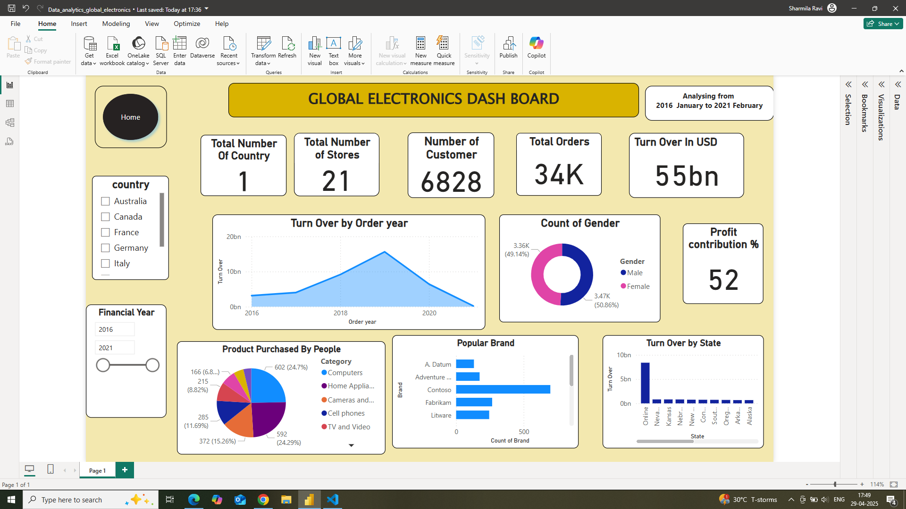

# 🛒 Electronics Store Data Analysis Dashboard

This project presents a comprehensive data analysis of an electronics store using SQL and Power BI. The goal is to derive meaningful insights on sales, customers, products, and store performance to support data-driven decision-making.

---

## 📊 Project Objectives

- Understand customer demographics and purchasing behavior
- Analyze product popularity and profitability
- Track overall and regional sales performance
- Visualize trends, seasonality, and currency impact
- Evaluate store-level operations and sales contributions

---

## 🗂️ Dataset Overview

The project uses the following datasets:

- **Customer Table**: Demographics, location, birth year
- **Sales Table**: Transaction-level sales data
- **Products Table**: Product details including cost, price, category
- **Stores Table**: Store location, size, open date
- **Exchange Rates Table**: Currency values by date

---

## ⚙️ Tools & Technologies

- **SQL**: For data cleaning, transformation, and analysis
- **Power BI**: For interactive dashboard and data visualization
- **Excel**: Used for initial exploration and minor adjustments

---

## 📈 Key Analyses

### 🔹 Customer Analysis
- Age and gender distribution
- Geographic segmentation (city, country, continent)
- Purchase frequency and spending behavior

### 🔹 Sales Analysis
- Overall sales trends and seasonal patterns
- Sales by product, store, and currency
- Exchange rate impact on global revenue

### 🔹 Product Analysis
- Top-selling and low-performing products
- Profit margin and revenue by category/subcategory

### 🔹 Store Analysis
- Sales vs. store size
- High-performing regions and store-wise sales ranking
- Store opening timelines vs. performance

---

## 📌 Highlights

- Age-group based customer segmentation using DAX
- Profitability analysis via SQL by calculating margin %
- Dynamic slicers, filters, and bookmarks in Power BI
- Regional comparison using map visualizations

---

## 🖼️ Dashboard Preview

Here is a snapshot of the interactive Power BI dashboard:

   
  
